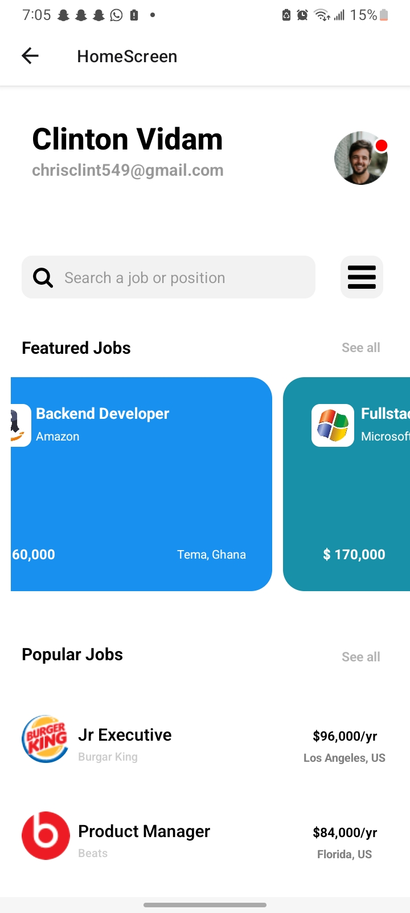
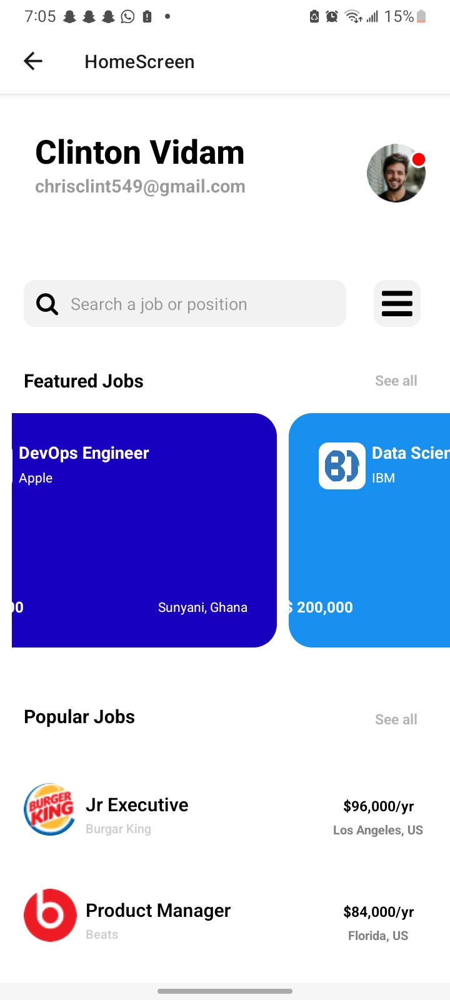
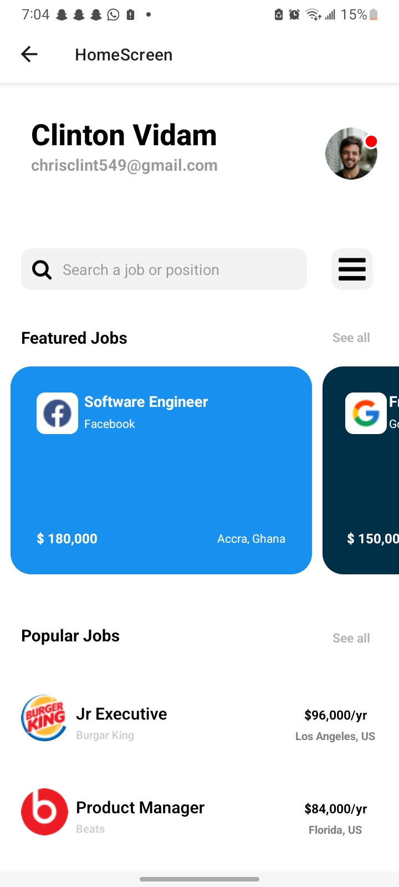
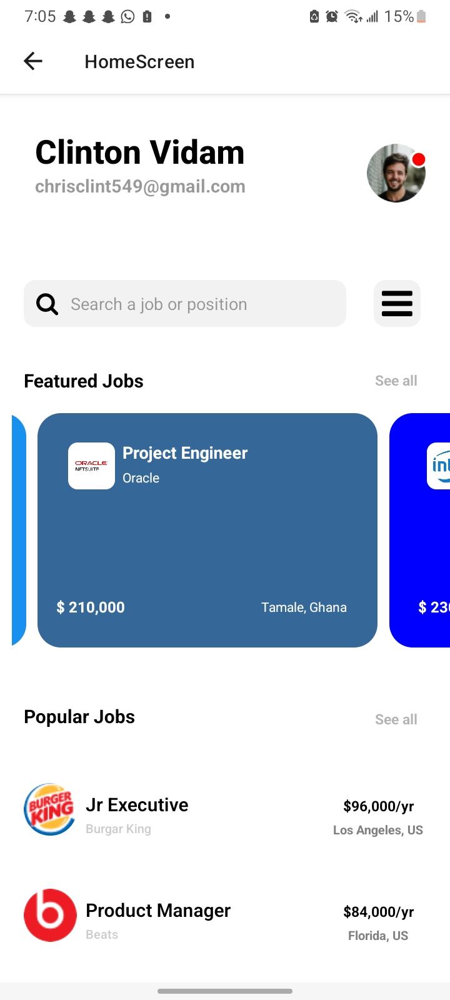
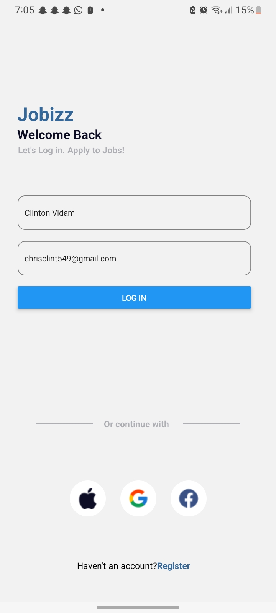

# rn-assignment4-11317254

## **Student ID**: 11317254

## Brief Description of each component's usage and their Screenshots

**PopularCard.js** : The PopularCard component, designed for React Native applications, showcases essential details about top job opportunities in a card-style format. It accepts properties such as company logos, locations, company names, offered salaries, and job titles. Enclosed within a TouchableOpacity, it hints at interactive functionality, allowing users to explore further details. By utilizing core React Native elements like View, Text, Image, and StyleSheet, the component ensures a clear and engaging presentation of job listings. The layout, styled using StyleSheet.create, places the logo on the left and aligns job title, salary, and company name on the right, with the job location at the bottom. This thoughtful styling enhances aesthetics and user-friendliness, making it an effective component for job listings within the application

**FeaturedCard.js** : The FeaturedCard component is a versatile and reusable element in React Native. It’s designed to display information within a card format, making it ideal for creating visually appealing cards in app interfaces. Developers can customize its appearance by passing props such as icon, title, subtitle, amount, location, and backgroundColor.

**HomeScreen.js** : The `HomeScreen` component functions as a pivotal section within a mobile app focused on job searching and recruitment. It prominently showcases sections for both featured and popular job listings. Users first encounter personalized details such as their name and email, accompanied by a profile image indicating online status. The top bar includes a search input field for job searches, paired with a search button, enhancing user interaction. Additionally, a menu icon grants access to additional app features.

The primary content areas feature horizontally scrollable lists for featured jobs and vertically scrollable lists for popular jobs. Each job card, whether featured or popular, presents key information like job title, company name, salary, and location, along with company logos for visual appeal and brand identification. The screen's design is meticulously crafted using React Native's `StyleSheet`, ensuring a cohesive visual language with consistent use of colors, fonts, and spacing to create an engaging and user-friendly interface.

**LoginScreen.js** : This React Native component designs a login screen for the "Jobizz" app using React and React Native elements. It manages name and email inputs with state hooks and navigates to the `HomeScreen` using the `handleLogin` function when the login button is pressed. The interface includes a main container, welcome text, input fields, a login button, separators for alternative login options (Apple, Google, Facebook), and a registration prompt for new users. The `StyleSheet` ensures consistent and attractive styling throughout the component.

**LoginForm.js**: The `LoginForm` component in React Native allows users to log in by entering their name and email. It uses `useState` hooks to manage these inputs and includes a `handleLogin` function that navigates to the "Home" screen when the login button is pressed. The form consists of `TextInput` fields for the name and email, along with a `Button` that triggers the login action.

The component is styled using a `StyleSheet` to ensure a cohesive and visually appealing layout. The styles define the dimensions and appearance of the input fields, including border properties, and customize the login button to make it visually distinct and user-friendly.

### Thank You