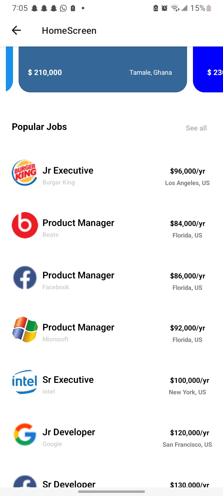

# rn-assignment4-11317254

## **Student ID**: 11317254

## Brief Description of each component's usage and their Screenshots

**PopularCard.js** : The PopularCard component, designed for React Native applications, showcases essential details about top job opportunities in a card-style format. It accepts properties such as company logos, locations, company names, offered salaries, and job titles. Enclosed within a TouchableOpacity, it hints at interactive functionality, allowing users to explore further details. By utilizing core React Native elements like View, Text, Image, and StyleSheet, the component ensures a clear and engaging presentation of job listings. The layout, styled using StyleSheet.create, places the logo on the left and aligns job title, salary, and company name on the right, with the job location at the bottom. This thoughtful styling enhances aesthetics and user-friendliness, making it an effective component for job listings within the application

